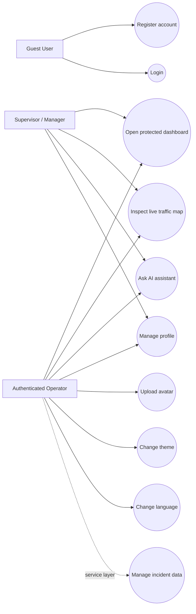
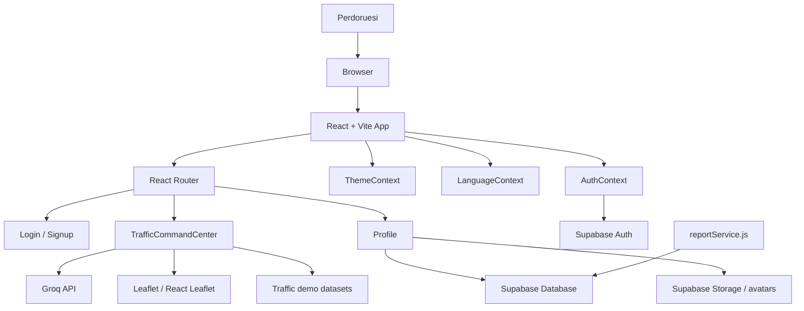
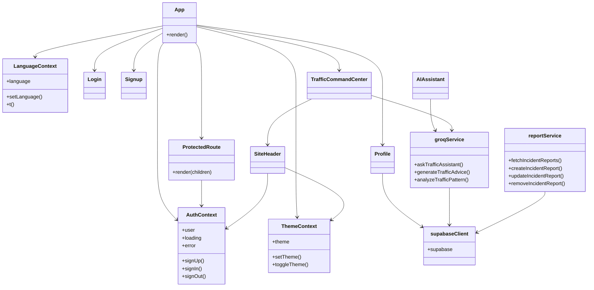
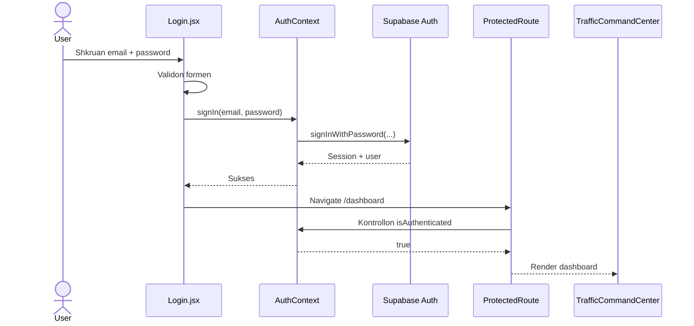
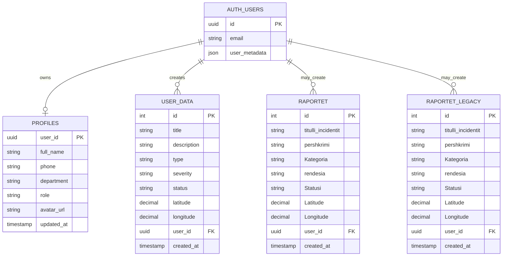

# SEMAFORI
## Dokumentimi Final i Projektit

**Titulli i projektit:** SEMAFORI - Smart Traffic Management System  
**Studenti:** Norit Qyqalla  
**Numri i indeksit:** `[Per t'u plotesuar]`  
**Lenda:** Programimi i Avancuar  
**Profesori:** `[Per t'u plotesuar]`  
**Institucioni:** `[Per t'u plotesuar]`  
**Viti akademik:** `2025/2026 (per t'u konfirmuar)`  
**Data e pergatitjes:** May 17, 2026  
**Tipi i aplikacionit:** Web application per monitorim dhe menaxhim te trafikut  
**Repozitori:** `SEMAFORI`

> Shenim: Numri i indeksit, emri i profesorit, institucioni, viti akademik perfundimtar dhe screenshot-et finale nuk mund te verifikohen vetem nga kodi. Ato jane shenuar qarte aty ku duhen plotesuar.

---

## 1. Faqja Ballore dhe Informacioni Baze

Ky dokument paraqet projektin **SEMAFORI**, nje prototip web per menaxhim dhe monitorim te trafikut urban. Projekti kombinon nje frontend modern me React, autentikim dhe ruajtje te dhenash me Supabase, vizualizim ne harte me Leaflet dhe asistence operative me AI permes Groq.

### Informacioni baze

- **Emri i projektit:** SEMAFORI
- **Autori i identifikuar ne kod/repo:** Norit Qyqalla
- **Lenda:** Programimi i Avancuar
- **Platforma:** Web
- **Audience kryesore:** operatore trafiku, supervizore dhe menaxhere
- **Mjedisi i deploy-it:** Vercel

---

## 2. Abstrakti

SEMAFORI eshte nje sistem web i ndertuar per te demonstruar menaxhimin modern te trafikut ne nje panel te vetem operacional. Problemi qe adresohet eshte fragmentimi i informacioneve te trafikut, ku operatori zakonisht duhet te kombinoje pamje te ndryshme, raporte manuale, karta, statistika dhe komunikim te shperndare ne mjete te ndryshme.

Zgjidhja e propozuar ne kete projekt i bashkon ne nje aplikacion te vetem autentikimin e perdoruesve, qasjen e mbrojtur ne panel, nje harte interaktive per pikat e trafikut, asistencen me AI, menaxhimin e profilit dhe nje shtrese sherbimesh per ruajtjen e incidenteve ne Supabase. Rezultati eshte nje prototip funksional dhe teknikisht i besueshem, i pershtatshem per prezantim akademik dhe per zgjerim te metejshem drejt nje sistemi me te plote per incidentet dhe analitiken e trafikut.

---

## 3. Hyrja

### 3.1 Konteksti dhe motivimi i projektit

Qytetet moderne kane nevoje per sisteme me te shpejta dhe me te qarta per te kuptuar gjendjen e trafikut, per te zbuluar pikat problematike dhe per te koordinuar reagimin. Nje panel i mire operacional duhet te jape pamje te menjehershme, qasje ne harte, te dhena te strukturuara dhe rekomandime te shpejta.

SEMAFORI eshte konceptuar si nje zgjidhje qe demonstron kete ide ne nivel prototipi duke perdorur teknologji moderne frontend dhe sherbime cloud.

### 3.2 Problemi qe zgjidhet

Problemi qendror i projektit eshte:

- mungesa e nje vendi te vetem per monitorimin e trafikut
- veshtiresia per te kombinuar informacionin vizual, raportet dhe autentikimin
- nevoja per nje nderfaqe te qarte per operatoret
- nevoja per nje shtrese zgjeruese qe mund te lidhet me AI dhe databaze reale

### 3.3 Qellimet dhe objektivat

Objektivat kryesore te projektit jane:

- te ndertohet nje aplikacion web profesional per monitorimin e trafikut
- te implementohet autentikim i sigurt dhe qasje e mbrojtur
- te integrohet nje harte interaktive per vizualizim gjeografik
- te shtohet asistence me AI per pyetje dhe rekomandime operative
- te mundesohet menaxhimi i profilit te perdoruesit
- te pergatitet nje shtrese sherbimi per CRUD te incidenteve ne Supabase
- te ruhet arkitekture modulare dhe e mirembajtshme

### 3.4 Struktura e raportit

Ky raport ndahet ne:

1. informacionin baze te projektit
2. abstraktin
3. hyrjen
4. analizen e kerkesave
5. dizajnin e sistemit
6. implementimin
7. testimin
8. udhezuesin e perdorimit
9. konkluzionet
10. referencat

---

## 4. Analiza e Kerkesave (Requirements Analysis)

### 4.1 Pershkrim i pergjithshem

Nga analiza e kodit del se aplikacioni aktual ka dy shtresa te rendesishme:

- **shtresa e ekspozuar ne route aktive:** `TrafficCommandCenter`, `Login`, `Signup`, `Profile`
- **shtresa e pergatitur per zgjerim:** `reportService`, `AIAssistant`, `TrafficMap`, `Settings`, skema standarde dhe legacy per tabela incidentesh

Kjo do te thote se projekti eshte nje prototip funksional me disa kapacitete te implementuara plotesisht dhe disa te tjera te pergatitura per integrim te plote ne UI.

### 4.2 Kerkesat funksionale

| ID | Kerkesa funksionale | Pershkrimi | Statusi |
|---|---|---|---|
| FR-01 | Regjistrimi i perdoruesit | Sistemi duhet te lejoje krijimin e nje llogarie te re me emer, email dhe fjalekalim. | E implementuar |
| FR-02 | Validimi i formularit te hyrjes | Sistemi duhet te validoje email-in dhe fjalekalimin para dergimit. | E implementuar |
| FR-03 | Validimi i formularit te regjistrimit | Sistemi duhet te kontrolloje emrin, email-in, fuqine e fjalekalimit dhe perputhjen e tij. | E implementuar |
| FR-04 | Autentikimi | Sistemi duhet te perdore Supabase Auth per login, signup dhe logout. | E implementuar |
| FR-05 | Route te mbrojtura | Vetem perdoruesit e autentikuar duhet te hyjne ne `/dashboard` dhe `/traffic-command-center`. | E implementuar |
| FR-06 | Paneli i trafikut | Sistemi duhet te shfaqe nje faqe kryesore me seksione overview, map, AI dhe about. | E implementuar |
| FR-07 | Vizualizimi ne harte | Sistemi duhet te shfaqe pikat e trafikut ne harte interaktive me popup-e informuese. | E implementuar |
| FR-08 | Asistenti AI | Sistemi duhet te pranoje pyetje nga perdoruesi dhe te ktheje pergjigje per trafikun. | E implementuar |
| FR-09 | Fallback AI | Ne mungese te API key ose ne rast gabimi, sistemi duhet te jape fallback lokal. | E implementuar |
| FR-10 | Menaxhimi i profilit | Perdorueseve duhet t'u lejohet editimi i emrit, telefonit, departamentit, rolit dhe avatars. | E implementuar |
| FR-11 | Ngarkimi i avatarit | Sistemi duhet te ruaje avatarin ne Supabase Storage. | E implementuar |
| FR-12 | Ruajtja e preferences se temes | Tema light/dark duhet te ruhet ne `localStorage`. | E implementuar |
| FR-13 | Mbeshteja dygjuheshe | Sistemi duhet te mbeshtese te pakten shqip dhe anglisht. | Pjeserisht e implementuar |
| FR-14 | Menaxhimi CRUD i incidenteve | Sistemi duhet te lejoje krijim, lexim, perditesim dhe fshirje te incidenteve. | Pjeserisht e implementuar ne shtresen e sherbimit |
| FR-15 | Perputhshmeri me skema legacy | Sistemi duhet te punoje si me `user_data` ashtu edhe me `raportet`/`Raportet`. | E implementuar |

### 4.3 Kerkesat jo-funksionale

| ID | Kerkesa jo-funksionale | Pershkrimi | Statusi |
|---|---|---|---|
| NFR-01 | Perdorueshmeria | Nderfaqja duhet te jete e kuptueshme dhe e organizuar qarte. | E implementuar |
| NFR-02 | Responsiviteti | Aplikacioni duhet te funksionoje ne desktop dhe mobile. | E implementuar |
| NFR-03 | Performanca | Navigimi dhe nderveprimet lokale duhet te ndihen te shpejta. | E implementuar, me paralajmerim per bundle size |
| NFR-04 | Siguria | Autentikimi duhet te kryhet nga Supabase dhe sekretet te vijne nga environment variables. | E implementuar |
| NFR-05 | Besueshmeria | Sistemi duhet te trajtoje offline, timeout dhe gabimet e rrjetit. | E implementuar |
| NFR-06 | Mirembajtja | Kodi duhet te jete modular, i ndare ne pages, components, context dhe services. | E implementuar |
| NFR-07 | Portabiliteti | Aplikacioni duhet te ndertohet dhe deploy-ohet ne hosting modern. | E implementuar |
| NFR-08 | Shkallezueshmeria | Arkitektura duhet te lejoje lidhjen me te dhena reale dhe zgjerime te ardhshme. | Pjeserisht e implementuar |
| NFR-09 | Integriteti i te dhenave | Raportet duhet te normalizohen ne menyre konsistente pavaresisht skemes. | E implementuar |
| NFR-10 | Accessibility | Kontrast, focus states dhe kontrolle te perdorshme me tastiere. | Pjeserisht e implementuar |

### 4.4 Use Case Diagram (UML-style)



### 4.5 User Stories

Edhe pse repo nuk permban artefakte formale sprintesh Agile, funksionalitetet mund te perkthehen ne user stories:

- Si vizitor, dua te regjistrohem ne sistem qe te kem qasje ne panelin e trafikut.
- Si perdorues i autentikuar, dua te hyj ne dashboard qe te shoh gjendjen e trafikut.
- Si operator, dua te klikoj pikat ne harte qe te kuptoj shpejt zonat problematike.
- Si operator, dua te pyes asistentin AI qe te marr rekomandime operative.
- Si perdorues, dua te modifikoj profilin tim qe informacioni personal te jete i perditesuar.
- Si sistem, dua te kem fallback per skema te ndryshme databaze qe te shmang deshtimin ne mjedise te ndryshme.

---

## 5. Dizajni i Sistemit (System Design)

### 5.1 Arkitektura e sistemit

Arkitektura e SEMAFORI mund te ndahet ne kater shtresa logjike:

- **Presentation layer:** faqet React dhe komponentet vizuale
- **Application layer:** context providers, route protection dhe logjika e nderveprimit
- **Data layer:** Supabase Auth, Database dhe Storage
- **Intelligence layer:** Groq API dhe fallback lokal

### 5.2 Diagrami i arkitektures



### 5.3 Diagrami i klasave (modulet kryesore)



### 5.4 Sequence Diagram - procesi i login-it



### 5.5 Activity Diagram - pergjigjja e AI

```mermaid
flowchart TD
    start([Start]) --> input[Perdoruesi shkruan pyetjen]
    input --> send{Ekziston input i vlefshem?}
    send -- Jo --> stop([Stop])
    send -- Po --> provider{Groq API key ekziston?}
    provider -- Po --> req[Dergim i kerkeses te Groq]
    req --> ok{Pergjigjja u kthye me sukses?}
    ok -- Po --> live[Shfaq pergjigjen live]
    ok -- Jo --> fallback[Ndihme lokale nga groqService]
    provider -- Jo --> fallback
    fallback --> show[Shfaq fallback response]
    live --> end([End])
    show --> end
```

### 5.6 ER Diagram



### 5.7 Dizajni i bazes se te dhenave

| Tabela / Bucket | Qellimi | Fushe kyce |
|---|---|---|
| `profiles` | Ruajtja e te dhenave shtese te profilit | `user_id`, `full_name`, `phone`, `department`, `role`, `avatar_url` |
| `user_data` | Skema standarde e incidenteve | `title`, `description`, `type`, `severity`, `status`, `latitude`, `longitude`, `user_id` |
| `raportet` | Skeme legacy e incidenteve | `Titulli i incidentit`, `Pershkrimi`, `Kategoria`, `Rendesia`, `Statusi`, `Latitude`, `Longitude` |
| `Raportet` | Variante legacy shtese | fusha te ngjashme me `raportet` |
| `avatars` bucket | Ruajtja e skedareve te avatarit | path per perdorues |

### 5.8 Marredheniet logjike

- `auth.users.id` lidhet me `profiles.user_id`
- `auth.users.id` mund te lidhet me `user_data.user_id`
- `auth.users.id` mund te lidhet edhe me tabelat legacy, nese ekziston `user_id`
- `avatars` ruan URL publike qe referencohet nga `profiles.avatar_url`

---

## 6. Implementimi

### 6.1 Teknologjite dhe gjuhet e programimit te perdorura

| Teknologjia | Roli ne projekt |
|---|---|
| JavaScript (ES Modules) | Gjuha kryesore e implementimit |
| React 19 | Ndertimi i UI ne menyre komponentesh |
| Vite 8 | Build tool dhe development server |
| React Router 7 | Routing dhe navigim |
| Tailwind CSS 3 | Stilizimi i nderfaqes |
| Supabase JS 2 | Auth, Database dhe Storage |
| Leaflet 1.9 | Harta interaktive |
| React Leaflet 5 | Integrimi i Leaflet me React |
| Groq SDK | Integrimi i AI assistant |
| Vercel | Deployment i aplikacionit |

### 6.2 Struktura e foldereve / moduleve

```text
SEMAFORI/
|-- docs/
|-- public/
|-- src/
|   |-- components/
|   |-- context/
|   |-- hooks/
|   |-- pages/
|   |-- services/
|   |-- App.jsx
|   |-- App.css
|   |-- index.css
|   \-- main.jsx
|-- package.json
|-- vite.config.js
\-- vercel.json
```

### 6.3 Shpjegimi i pjeseve kryesore te kodit

#### `src/App.jsx`

- inicializon `ThemeProvider`, `LanguageProvider`, `Router` dhe `AuthProvider`
- definon route-t publike dhe te mbrojtura
- ridrejton `/` ne `/dashboard`

#### `src/context/AuthContext.jsx`

- menaxhon sesionin e perdoruesit
- implementon `signUp`, `signIn`, `signOut`
- trajton offline, timeout dhe gabime rrjeti

#### `src/components/ProtectedRoute.jsx`

- kontrollon nese perdoruesi eshte autentikuar
- lejon render vetem per dashboard-in e mbrojtur
- ridrejton te `/login` ne mungese sesioni

#### `src/pages/TrafficCommandCenter.jsx`

- eshte faqa kryesore aktive e sistemit
- permban hero section, statistika, njoftime, harte, AI chat dhe seksion informues
- perdor te dhena demo per marker-at dhe statistikat operative

#### `src/pages/Profile.jsx`

- ngarkon te dhenat e profilit nga `profiles`
- bie ne fallback te `auth.user_metadata` kur tabela mungon ose RLS e bllokon
- lejon editimin e profilit dhe ngarkimin e avatarit

#### `src/services/reportService.js`

- mbeshtet CRUD per `user_data`, `raportet` dhe `Raportet`
- normalizon statusin, tipin, rendesine dhe koordinatat
- ka logjike kompatibiliteti per skema standarde dhe legacy

#### `src/services/groqService.js`

- lidhet me Groq per pyetje AI
- ofron fallback lokal ne mungese API key ose gabimi
- gjeneron analiza dhe keshilla te shkurtra operative

### 6.4 Sfida teknike dhe zgjidhjet

| Sfida | Zgjidhja e implementuar |
|---|---|
| Mungesa e `profiles` table ose kufizime RLS | Fallback te `auth.user_metadata` ne `Profile.jsx` |
| Skema te ndryshme databaze per incidentet | `reportService.js` provon automatikisht tabela standarde dhe legacy |
| Mungesa e API key te Groq | `groqService.js` jep fallback lokal ne vend te deshtimit total |
| Gabime offline / timeout ne autentikim | `AuthContext.jsx` kthen mesazhe te qarta per perdoruesin |
| Persistenca e preferencave te UI | `ThemeContext` dhe `LanguageContext` ruajne vlerat ne `localStorage` |
| Qasje e mbrojtur ne dashboard | `ProtectedRoute.jsx` kontrollon sesionin para render-it |

### 6.5 Vezhgime teknike te rendesishme

- Route aktive kryesore eshte `TrafficCommandCenter`; `Dashboard.jsx` ekziston ne repo por nuk eshte route aktive.
- Faqja `/profile` nuk eshte route e mbrojtur, por kalon ne modalitet "guest access" kur perdoruesi nuk eshte i loguar.
- Build-i i prodhimit kalon, por Vite jep paralajmerim per bundle size me te madh se 500 kB. Kjo sugjeron code-splitting ne nje iteracion te ardhshem.

---

## 7. Testimi

### 7.1 Strategjia e testimit

Per kete projekt jane perdorur keto nivele testimi:

- **static quality checks:** `eslint` per stilin dhe problemet bazike te kodit
- **build verification:** `vite build` per te siguruar qe projekti ndertohet per prodhim
- **manual functional review:** analiza e flow-ve kryesore per login, signup, protected routes, AI fallback, profil dhe teme
- **integration-oriented code validation:** verifikim i integrimeve Supabase, Groq dhe Leaflet ne nivel kodi

### 7.2 Test cases dhe rezultatet

| ID | Test case | Hapi / metoda | Rezultati |
|---|---|---|---|
| TC-01 | Production build | U ekzekutua `npm.cmd run build` | **Kaloi** me sukses me May 17, 2026 |
| TC-02 | Lint i projektit | U ekzekutua `npm.cmd run lint` | **Kaloi** me sukses me May 17, 2026 |
| TC-03 | Validimi i login-it | Kontroll i `Login.jsx` per email/fjalekalim | **I mbuluar ne kod** |
| TC-04 | Validimi i signup-it | Kontroll i `Signup.jsx` per emer, email, password dhe confirm password | **I mbuluar ne kod** |
| TC-05 | Mbrojtja e dashboard-it | Kontroll i `ProtectedRoute.jsx` per ridrejtim te paautentikuar | **I mbuluar ne kod** |
| TC-06 | Persistenca e temes | Kontroll i `ThemeContext.jsx` dhe `localStorage` | **I mbuluar ne kod** |
| TC-07 | Fallback AI | Kontroll i `groqService.js` per mungese API key / gabim | **I mbuluar ne kod** |
| TC-08 | Fallback i profilit | Kontroll i `Profile.jsx` kur `profiles` mungon ose bllokohet | **I mbuluar ne kod** |
| TC-09 | Kompatibiliteti i skemes se incidenteve | Kontroll i `reportService.js` per `user_data`, `raportet`, `Raportet` | **I mbuluar ne kod** |

### 7.3 Rezultati i kontrollit teknik

Rezultatet e verifikuara ne kete workspace:

- `npm.cmd run build` perfundoi me sukses
- `npm.cmd run lint` perfundoi me sukses
- u shfaq nje paralajmerim i Vite per madhesi chunk-u mbi 500 kB

### 7.4 Bug-et e gjetura dhe si jane korrigjuar

Nga analiza e implementimit duken te adresuara keto probleme reale:

- **Problemi:** API key e Groq mund te mungoje.  
  **Zgjidhja:** sistemi kalon ne fallback lokal dhe nuk ndalet plotesisht.

- **Problemi:** tabela `profiles` mund te mos ekzistoje ose te jete e bllokuar nga RLS.  
  **Zgjidhja:** profili mbushet nga `auth.user_metadata`.

- **Problemi:** strukturat e databazes mund te ndryshojne mes `user_data`, `raportet` dhe `Raportet`.  
  **Zgjidhja:** `reportService.js` ka normalizim dhe prova automatike per tabela/fusha te ndryshme.

- **Problemi:** perdoruesi mund te jete offline ose kerkesa te skadoje gjate login/signup.  
  **Zgjidhja:** `AuthContext.jsx` jep mesazhe te qarta per offline, timeout dhe network error.

### 7.5 Cfare mungon ne testim

Aktualisht mungojne:

- teste unit te automatizuara
- teste integration te automatizuara
- teste end-to-end me browser automation
- screenshot-e reale te flow-ve te loguara brenda dashboard-it

---

## 8. Udhezuesi i Perdorimit (User Manual)

### 8.1 Si instalohet / konfigurohet sistemi

#### Kerkesat paraprake

- Node.js i instaluar
- npm i disponueshem
- nje projekt Supabase me Auth, Database dhe Storage
- environment variables te konfiguruara

#### Environment variables

Krijo ose ploteso `.env.local` me:

```env
VITE_SUPABASE_URL=your_supabase_url
VITE_SUPABASE_ANON_KEY=your_supabase_anon_key
VITE_GROQ_API_KEY=your_groq_api_key
```

#### Komandat kryesore

```bash
npm install
npm run dev
npm run build
npm run lint
npm run preview
```

#### Konfigurimi i Supabase

Per funksionim te plote rekomandohen:

- Auth i aktivizuar per email/password
- tabela `profiles`
- tabela `user_data` ose nje nga tabelat legacy `raportet` / `Raportet`
- storage bucket `avatars`

### 8.2 Si perdoret aplikacioni

#### Hapi 1 - Hapja e aplikacionit

- nis development server me `npm run dev`
- hap URL-ne lokale te Vite ne browser

#### Hapi 2 - Regjistrimi

- shko te `/signup`
- ploteso emrin, email-in, fjalekalimin dhe konfirmimin
- dergo formularin

#### Hapi 3 - Hyrja ne sistem

- shko te `/login`
- ploteso email-in dhe fjalekalimin
- pas suksesit, sistemi te dergon ne `/dashboard`

#### Hapi 4 - Perdore dashboard-in

Ne dashboard perdoruesi mund te:

- lexoje overview dhe statistikat
- shikoje harten interaktive te trafikut
- klikoje marker-at per detaje
- pyese AI assistant per keshilla ose analiza
- lexoje seksionet e informimit dhe pershkrimit te sistemit

#### Hapi 5 - Menaxhimi i profilit

- shko te `/profile`
- ndrysho emer, telefon, departament, rol dhe avatar
- ruaj ndryshimet

#### Hapi 6 - Personalizimi i pamjes

- perdor butonin e temes ne header
- sistemi ruan preferencen ne `localStorage`

### 8.3 Screenshots te rekomanduara per dokumentin final

Per shkak te kufizimeve te browser-it headless ne kete sesion, screenshot-et reale nuk u gjeneruan automatikisht. Megjithate, per te plotesuar kerkesen finale te dokumentimit, rekomandohet te futen keto imazhe:

| Emri i screenshot-it | URL / pamja | Statusi |
|---|---|---|
| `login-page.png` | `/login` | Per t'u shtuar manualisht |
| `signup-page.png` | `/signup` | Per t'u shtuar manualisht |
| `profile-guest-page.png` | `/profile` pa login | Per t'u shtuar manualisht |
| `dashboard-overview.png` | `/dashboard#overview` pas login | Per t'u shtuar manualisht |
| `dashboard-map.png` | `/dashboard#map` pas login | Per t'u shtuar manualisht |
| `dashboard-ai.png` | `/dashboard#ai` pas login | Per t'u shtuar manualisht |

### 8.4 Shenime praktike per prezantim

- verifiko qe environment variables jane te sakta para demos
- sigurohu qe Supabase project eshte aktiv
- kontrollo login/signup perpara prezantimit
- kontrollo qe harta ngarkohet dhe AI assistant kthen pergjigje
- nese Groq mungon, shpjego fallback-un lokal si pjese te robustness-it te sistemit

---

## 9. Konkluzionet

### 9.1 Cfare u arrit

Projekti arrin te demonstroje me sukses:

- nje aplikacion web modern per trafikun
- autentikim real me Supabase
- panel te mbrojtur per perdorues te loguar
- harte interaktive me Leaflet
- asistence me AI me fallback lokal
- menaxhim profili me avatar dhe metadata
- arkitekture modulare, te gatshme per zgjerim

### 9.2 Kufizimet e projektit

Kufizimet kryesore aktuale jane:

- dashboard-i aktiv perdor kryesisht te dhena demo dhe jo sensor-data reale
- CRUD i incidenteve ekziston ne shtresen e sherbimit, por jo i ekspozuar plotesisht ne route aktive
- mbeshtetja e gjuhes ekziston, por nuk aplikohet ne menyre uniforme ne te gjitha faqet
- mungojne testet e automatizuara
- bundle size i frontend-it eshte ende i madh dhe kerkon code-splitting
- screenshot-et finale per dokumentin duhet te shtohen manualisht

### 9.3 Sugjerimet per zhvillim te metejshem

- lidhja e plote e dashboard-it me `reportService.js`
- shtimi i formeve dhe tabelave reale per incidentet ne UI aktive
- integrimi me API ose sensor-data reale te trafikut
- shtimi i role-based access control
- implementimi i unit tests dhe end-to-end tests
- optimizimi i bundle-it me lazy loading dhe code splitting
- plotesimi i lokalizimit ne te gjitha faqet dhe komponentet

---

## 10. Referencat

React. (n.d.). *Quick Start*. Retrieved May 17, 2026, from https://react.dev/learn

Vite. (n.d.). *Getting Started*. Retrieved May 17, 2026, from https://vite.dev/guide/

Supabase. (n.d.). *Auth*. Retrieved May 17, 2026, from https://supabase.com/docs/guides/auth/

Supabase. (n.d.). *Storage*. Retrieved May 17, 2026, from https://supabase.com/docs/guides/storage

Leaflet. (n.d.). *Quick Start Guide*. Retrieved May 17, 2026, from https://leafletjs.com/examples/quick-start/

React Leaflet. (n.d.). *Introduction*. Retrieved May 17, 2026, from https://react-leaflet.js.org/docs/start-introduction

Groq. (n.d.). *Text Generation*. Retrieved May 17, 2026, from https://console.groq.com/docs/text-chat

Vercel. (2026, January 30). *Vercel Documentation*. https://vercel.com/docs/

---

## Shtojce e shkurter: Informacion qe duhet plotesuar nga studenti

Para dorezimit perfundimtar, ploteso keto fusha:

- numrin e indeksit
- emrin e profesorit
- institucionin
- vitin akademik perfundimtar, nese deshiron formulim ndryshe nga `2025/2026`
- screenshot-et reale te aplikacionit
